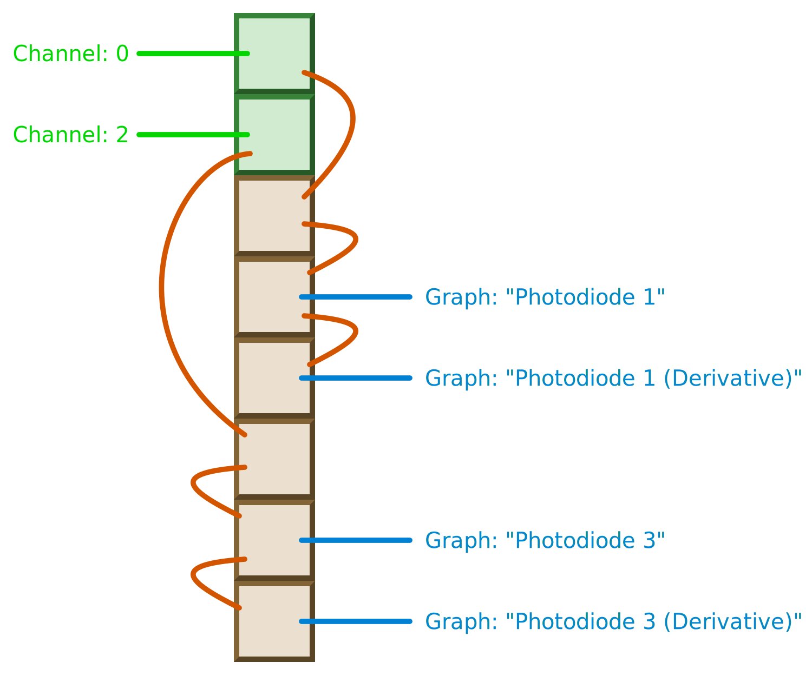

Bloodview: Live-view and control application
============================================

This is a simple SDL application that controls a Bloodlight device,
and renders samples on the screen in real time.

It allows the user to configure and run acquisitions from a simple UI.
Acquisition data is recorded to file in the current working directory,
with a filename containing the start time of the acquisition.

Building
--------

Bloodview uses [LibCYAML](https://github.com/tlsa/libcyaml), so before
attempting to build Bloodview, fetch the submodule:

    git submodule init
    git submodule update

To build Bloodview, from the `host/` directory, run:

    make

You can run it with:

    make run

You can build and run a debug build with:

    make VARIANT=debug run

The Makefile allows you to pass arguments to Bloodview, so you could load
the config saved last time Bloodview was run with:

    make run BV_ARGS="-c previous.yaml"

Or use the `runp` target as a shorthand:

    make runp

Some [default configs](config/) are provided for each of the hardware revisions,
for example:

    make run BV_ARGS="-c rev1-default.yaml"
    make run BV_ARGS="-c rev2-default.yaml"

Pass `-d` to automatically select the correct default config for the device:

    make run BV_ARGS="-d"

Or use the `rund` target as a shorthand:

    make rund

User Interface
--------------

Bloodview supports user interaction using both keyboard and mouse input.
The controls depend on the context.

### The main menu

The main menu can be opened at any time, and it is though the main
menu that Bloodview and the device are configured.

| Key                     | Meaning                                 |
| ----------------------- | --------------------------------------- |
| <kbd>Esc</kbd>          | Toggle whether the main menu is shown.  |
| <kbd>Return</kbd>       | Activate current menu entry.            |
| <kbd>Cursor Right</kbd> | Activate current menu entry.            |
| <kbd>Cursor Left</kbd>  | Traverse up to parent menu.             |
| <kbd>Cursor Up</kbd>    | Cycle current menu entry up.            |
| <kbd>Cursor Down</kbd>  | Cycle current menu entry down.          |

If the main menu is open, it will consume keyboard input.

You can also use the mouse to interact with the menu. The <kbd>RIGHT</kbd>
mouse button opens the menu. Clicking outside the menu closes it.

The <kbd>LEFT</kbd> mouse button selects a given menu entry. If you're in a
sub-menu, clicking the <kbd>RIGHT</kbd> mouse button over the menu navigates
back to the parent menu.

### The graph view

During an acquisition, graphs are drawn in real time, to show the progress
of the acquisition.

| Key                     | Meaning                             |
| ----------------------- | ----------------------------------- |
| <kbd>i</kbd>            | Toggle graph inversion.             |
| <kbd>Return</kbd>       | Toggle single graph mode.           |
| <kbd>Cursor Up</kbd>    | Increase scale in the Y direction.  |
| <kbd>Cursor Down</kbd>  | Decrease scale in the Y direction.  |
| <kbd>Page Up</kbd>      | Cycle current graph selection up.   |
| <kbd>Page Down</kbd>    | Cycle current graph selection down. |

The mouse can also be used to interact with the graphs.

Clicking the <kbd>LEFT</kbd> mouse button on a graph will enter single
graph mode. Clicking the <kbd>LEFT</kbd> mouse button again returns to
multi-graph view. While in single graph view, moving the mouse up and
down will rotate through the available graphs.

Using the vertical mouse scroll wheel will alter the vertical scaling of
the selected graph (or all graphs, if <kbd>Shift</kbd> is pressed).

Using the horizontal mouse scroll wheel will alter the horizontal scaling of
the selected graph (or all graphs, if <kbd>Shift</kbd> is pressed).

Clicking the <kbd>MIDDLE</kbd> mouse button will flip a graph upside-down.

Recording data from a Bloodlight device
---------------------------------------

### Setup

First make sure your Bloodlight has been flashed with the firmware and
connected to the host computer via USB.  On startup, Bloodview should
automatically detect the device, and print out details on the command
line.  For example:

    Using device: /dev/ttyACM0 (ct-bloodlight:000000).

If you have multiple Bloodlight devices connected via USB, you can select
which one to use by running with the `-D` or `--device-path` command line
argument:

    make run BV_ARGS="-D /dev/ttyACM2"

Once connected, Bloodview will send some requests to the device to
discover things like the device version and hardware capabilities.

Bloodview starts up, opening a new window showing the the main menu.

### Configuration

If you loaded a config file, the device will already be set up for use.
The `Config` menu entry allows any aspect of the device setup to be tweaked.

The actual acquisition options can be set up in the `Config > Acquisition`
menu.  The sampling rate of the acquisition can be set here, as well as the
emission mode and the detection mode.

#### Emission mode

This refers to whether the device is set up in `Continuous` mode
or `Flash` mode.  In `Continuous` mode, the chosen LEDs remain on constantly,
and the selected photo-diodes are sampled continuously.  In `Flash` mode, the
LEDs are flashed in sequence, and the sampling for each LED is done in sequence.
`Flash` mode is good for performing multi-spectral analysis of different
wavelengths.  `Continuous` mode is good for simply viewing a pulse.

The number of output channels for an acquisition depends on the emission mode.
In `Continuous` mode, the number of output channels is equal to the number of
enabled sources (photo-diodes, etc).  In `Flash` mode, the number of output
channels depends on the number of LEDs configured in the flash pattern; one
output channel per LED.

#### Detection mode

This determines whether to operate in `Reflective` mode or `Transmissive`
mode.  In `Transmissive` mode, a second device must be connected via the SPI
pins. In this mode, one Bloodlight device emits light and the other device
detects it.  In `Reflective` mode, emission and detection are done on the same
device.

#### Source configuration

Sources directly relate to the sources that the hardware acquires samples from.
For example, the photo-diodes.  These configuration options are used to tune the
sensitivity and amplification for each source.  Software oversample is the
number of samples from the hardware that are summed into a single reading.

Whether op-amps are available for any given source is determined by the
hardware.  Information about each source's hardware capabilities is provided
by the device in response to source capability requests sent when Bloodview
is started.

#### Channel configuration

Channels are a logical layer that Bloodlight provides to help distinguish the
origin of samples.  In `Continuous` mode, channels map directly to sources.  In
`Flash` mode, channels map the particular LEDs.  Multiple channels may map to
the same physical source, and there may be more channels than sources.

Channel configuration controls whether samples should be returned as 16-bit
values (by shifting and offsetting them), or as 32-bit values.  Using 16-bit
samples allows a higher sample rate to be achieved before the USB link is
saturated.  The shift and offset values to apply can be configured.  If 32-bit
sample mode is enabled, the shift and offset values are ignored and zero is
used.

You can also choose whether the channel should be inverted (vertically flipped).

#### Primitive filtering

There are a few basic sample filtering options available in the `Filtering`
submenu.  This allows denoising (such as for removing 50Hz AC noise),
normalization (which attempts to reduce the low frequency variations),
and derivative (which allows the derivatives of the graphs to be rendered).

For more advanced filtering, see the data processing pipeline section below.

### Calibration

Finding the best settings for configuring the sources and channels to get the
most accurate recordings can be fiddly, so Bloodview has a calibration mode.

This is what happens when you choose `Calibrate` on the main top-level menu.
It starts a 32-bit acquisition, waits two seconds (for the values to settle),
and then starts tracking the minimum and maximum values seen for each of the
channels.

You can stop the calibration by choosing `Stop` from the main menu.  When the
calibration is stopped, the calibration mode will automatically configure the
channel and source settings to achieve optimal readings.

### Acquisition

An acquisition can be run after calibration.  It is started with the
`Acquisition` menu option, and stopped with the `Stop` option.

Both calibration runs and acquisitions will save the messages sent to and
from the Bloodlight device to a YAML file, which can be used for off-line
data processing.

During a calibration or an acquisition, Bloodview will render graphs of the
samples on screen, so you can see what is going on.

Data processing pipelines
-------------------------

In the `Config` menu, you can change the `Setup mode` from `Custom` to
`Data processing pipeline`.  This allows various predefined data processing
setups to be selected, and disables the primitive filters.  These predefined
setups are loaded from a YAML file ([resources/filters.yaml]) on startup.

### Filters

There are two components to filters.  There is the implementation of the
filter in [src/dpp/filter] and there is the filter definition in the filters
section of [resources/filters.yaml].

The filter definition states the parameters that the filter takes, the number
of inputs and the number of outputs.  Each input, output, and parameter has a
name that it can be referred to by.  Each filter must have a unique name.

```yaml
filters:
  - name: Average
    parameters:
      - name: frequency
        kind: double
      - name: normalise
        kind: bool
    input:
      - name: samples
        kind: stream
    output:
      - name: averaged
        kind: stream

  - name: Derivative
    input:
      - name: in
        kind: stream
    output:
      - name: out
        kind: stream
```

The implementation is the C code that matches up to the filter definition
and actually performs the filter action on sample data.

Filters implement three callback functions, an initialisation function that
creates an instance of the filter, a processing function that runs the filter
over the data, and a finalisation function that destroys the filter instance.

### Pipelines

Pipelines are defined in the pipelines section of [resources/filters.yaml].
Pipelines have unique names and they define two things: a filter list
and a list of pipeline stages.

The filter list is the list of filter instances that will be required by the
pipeline.  This is were any parameter values for the filter instances are set
up, and each filter instance is given an arbitrary unique label.  They also
have a filter name, which is used to look up the right filter definition and
implementation.

The list of pipeline stages links up filter inputs and outputs.  Each stage is
a defines connection between a `from` endpoint and a `to` endpoint.  Data can
flow from channels or filter output endpoints, and it can flow to graphs or
filter input endpoints.  Each stage in the pipeline's stages sequence defines
one single connection along which data flows.

```yaml
- name: Cleanup & Derivative
  filters:
    - label: F1
      filter: Average
      parameters:
        - name: normalise
          value:
            bool: true
        - name: frequency
          value:
            double: 0.5
    - label: F2
      filter: Average
      parameters:
        - name: normalise
          value:
            bool: false
        - name: frequency
          value:
            double: 50
    - label: F3
      filter: Derivative
  stages:
    - from:
        channel:
          label: C1
      to:
        filter:
          label: F1
          endpoint: samples
    - from:
        filter:
          label: F1
          endpoint: averaged
      to:
        filter:
          label: F2
          endpoint: samples
    - from:
        filter:
          label: F2
          endpoint: averaged
      to:
        filter:
          label: F3
          endpoint: in
    - from:
        filter:
          label: F2
          endpoint: averaged
      to:
        graph:
          label: G1
    - from:
        filter:
          label: F3
          endpoint: out
      to:
        graph:
          label: G2
```

Each endpoint has a type (i.e. channel, filter, or graph).  For filter
endpoints, whether it is an input or an output is determined by whether it is
referenced as a `to` or a `from` endpoint.  Filter endpoints specify the filter
input or output name, defined in the filter definition.  This is used to ensure
the filter gets the order of its inputs and outputs correct in the case of
filters with multiple input and/or output endpoints.

### Setups

Setups are where it all comes together.  A setup has a name, an emission mode,
and a series of contexts.  Each context specifies a pipeline name to use, and
the input acquisition channels and output graphs that the pipeline will
ultimately read from and render to.  These channels and graphs are given
labels to match that needed by the specified pipeline.  Multiple different
pipelines may be used in a given setup, by using different contexts.

```yaml
- name: PD1 & PD3 (with derivatives)
  mode: Continuous
  contexts:
    - pipeline: Cleanup & Derivative
      channels:
        - label: C1
          channel: 0
      graphs:
        - label: G1
          name: Photodiode 1
          colour: { hsv: { h: 90, s: 100, v: 100 } }
        - label: G2
          name: Photodiode 1 (Derivative)
          colour: { hsv: { h: 90, s: 50, v: 90 } }
    - pipeline: Cleanup & Derivative
      channels:
        - label: C1
          channel: 2
      graphs:
        - label: G1
          name: Photodiode 3
          colour: { hsv: { h: 0, s: 100, v: 100 } }
        - label: G2
          name: Photodiode 3 (Derivative)
          colour: { hsv: { h: 0, s: 50, v: 90 } }
```

This setup creates four graphs, from two input channels.

### Data processing

The way an acquisition works is that the device sends out messages containing
sample data.  Each message contains samples for one channel.  All channels
have the same sampling rate.

In the Bloodview data code, there is a FIFO per channel which stores up the
samples from each channel.  Once the Nth sample for all channels has been
received, that sample N is read from each of the channel FIFOs into the data
processing pipeline.

The data processing pipeline actually takes the form of a simple array of
values.  The number of entries in the array is equal to the number of channels
plus the number of filter outputs defined by the chosen setup's pipelines.
Any slot in the pipeline can be graphed.



This array is created at the start of the acquisition and all the data is fed
through the same array, so there is no excessive memory allocation / free
churn during acquisition.

The processing of sample N (one sample N from each enabled channel) is done
by writing the raw samples from the channels into the first slots of the
data processing pipeline array, in the correct order.

When each filter instance is created it is told at which offset in the array
to read its input(s) from, and which offsets to write its output(s) to.
Processing sample N is a simple matter of running each filter instance in
turn over the array.

The correct ordering of the filters is defined by the pipeline building
resolver on instantiation.

Once all the filters have been run, any slots that are to be graphed are
read from, and used to update their respective graphs.
